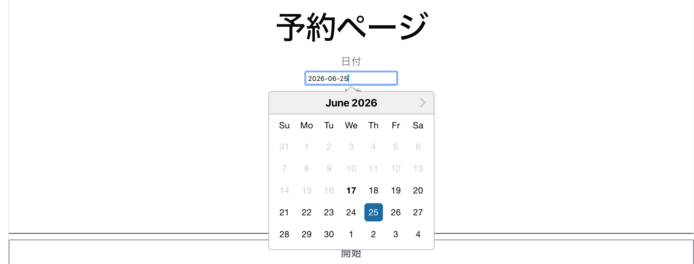
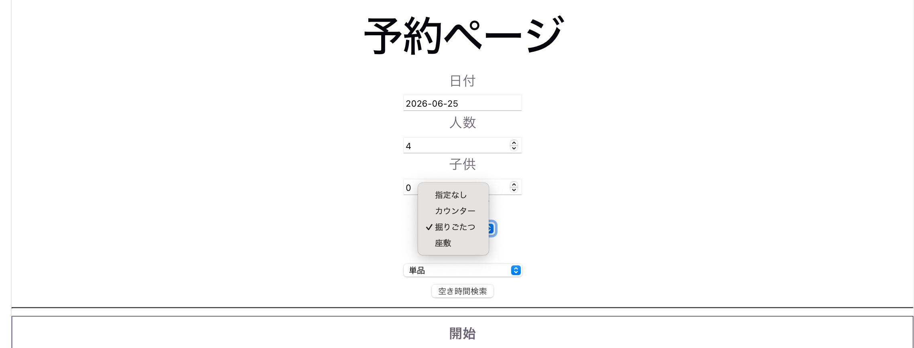
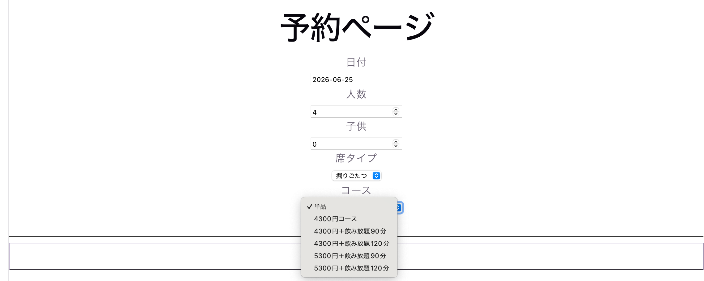
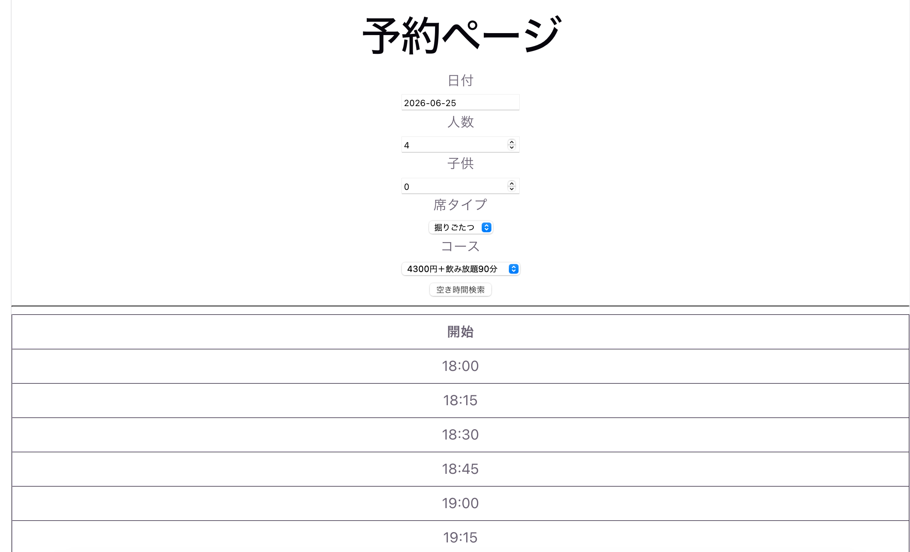
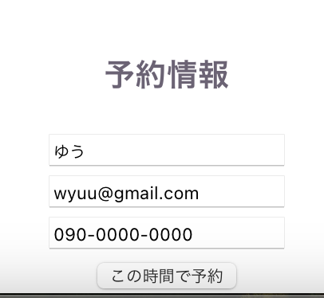
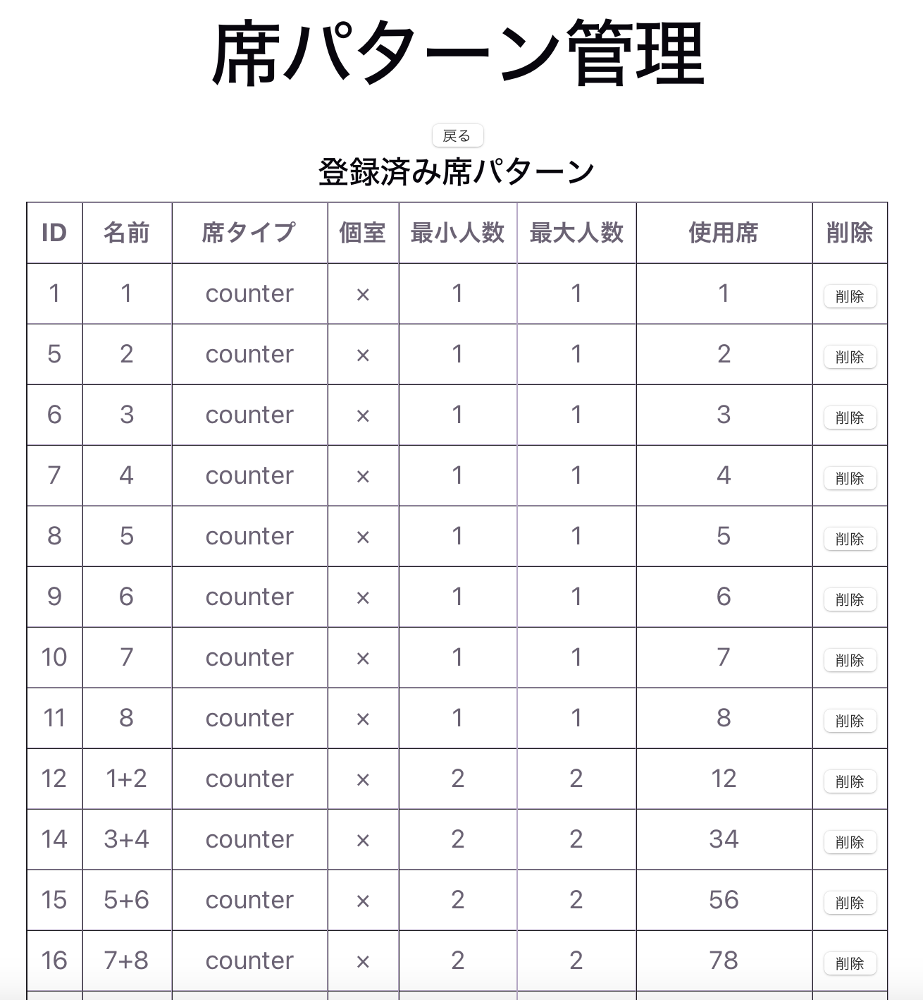
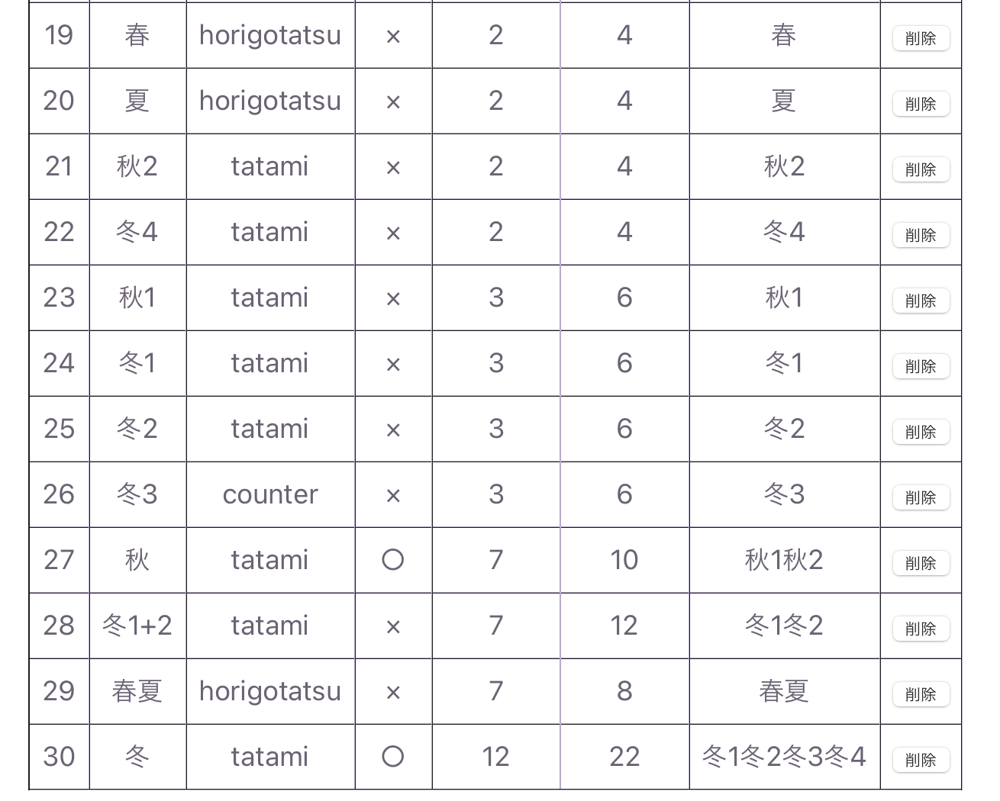

# 飲食店向け・予約管理システム

飲食店のインターネット予約をするためのWebアプリケーションです。  

- 大人数の予約の際に、複数の席を組み合わせて使うことがある
- 組み合わせることができる席のパターンが決まっている

このように席の運用方法が複雑な店舗の予約システムです。

---

## 技術スタック

- Frontend: JavaScript React
- Backend: Python FastAPI
- Database: PostgreSQL
- Authentication: JWT
- ORM: SQLAlchemy

---

## 機能一覧

### ユーザー機能
- 管理者ログイン / ログアウト（JWT認証）

### 予約機能
- 予約（日付、人数、席の種類、コースを選択 -> 予約可能な時間一覧 -> 時間を選択し、名前などの情報を入力して予約）

↓（管理者機能）
- 席の設定・管理
- 予約作成・変更・削除
- 任意の日付の予約一覧

---

## 工夫した点

- REST API設計を意識してエンドポイントを整理
- JWT認証によるログイン機能を実装
- 席の運用方法に合わせたDB設計
- 予約競合が起きないようなロジック

---

## テーブル設計

### seats テーブル
単体の席情報を管理するテーブル  
例：カウンター席1、テーブル席A など

- id
- name

---

### seat_patterns テーブル
実際の運用単位となる席の「組み合わせ」を管理するテーブル  
複数の席をまとめて1つの予約単位として扱う

例：
- 2人用テーブル
- 半個室（テーブルA + B）

- id
- name
- seat_type（カウンター、掘りごたつ、座敷）
- is_private（個室かどうか）
- min_peope
- max_people

---

### pattern_members テーブル
seat_patterns と seats を紐付ける中間テーブル  
どの席がどのパターンに含まれるかを管理する

- pattern_id（FK → seat_patterns.id）
- seat_id（FK → seats.id）

※ 多対多関係を表現するためのテーブル

---

## スクリーンショット

- 予約画面

  
  
  
  
  

- 管理者画面
- 席（組み合わせ）の設定

  
  

